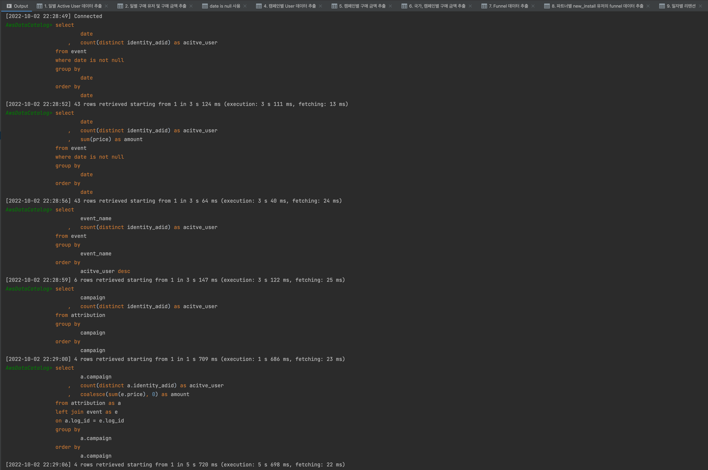
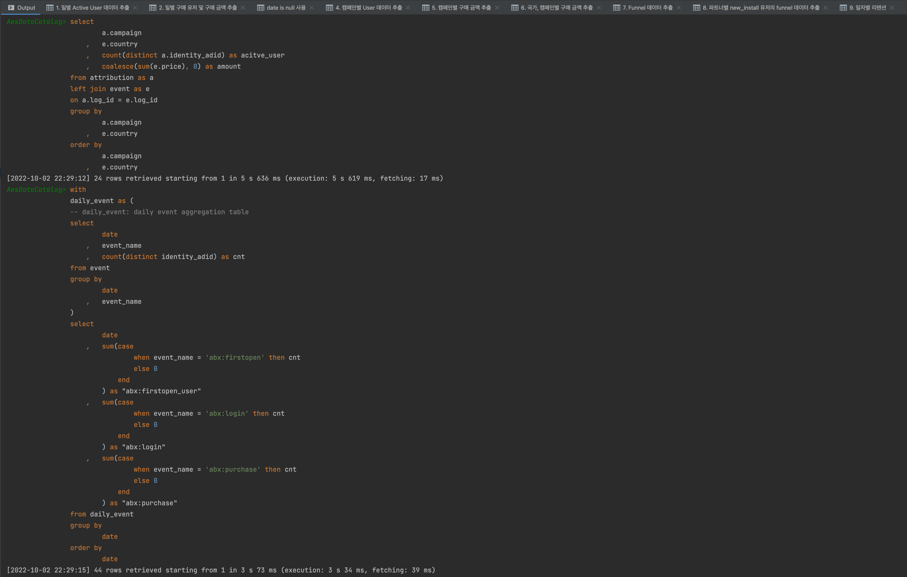
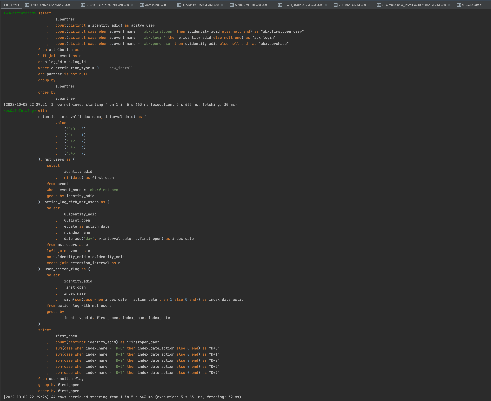

# aws-athena

# Directory structure
```
├── csv/                                  # query-1~9 실행 결과 저장
├── script/                               # 사용자 정의 함수 (sql script parser)
├── sql/                                  # query-1~9 스크립트 파일
├── create_athena_datacatalog.ipynb       # AWS Athena data catalog 등록 코드 (CSV to Parquet 포함)
└── execute_athena_query.ipynb            # query-1~9 실행 및 저장 코드
```

---

# Execute logs
## query-1~5 logs


## query-6~7 logs


## query-8~9 logs

